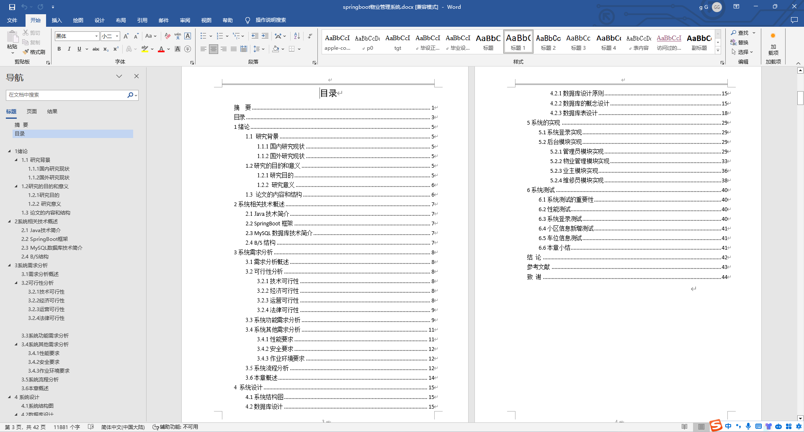
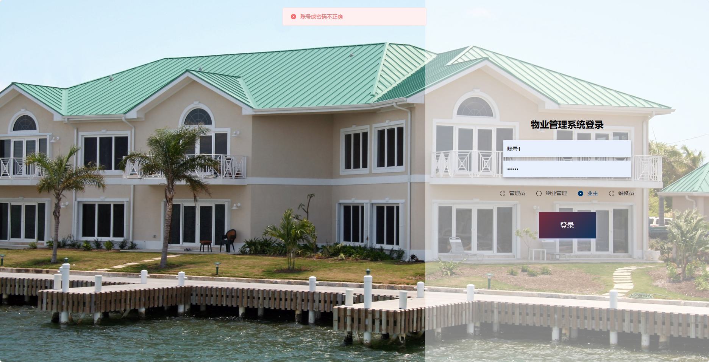
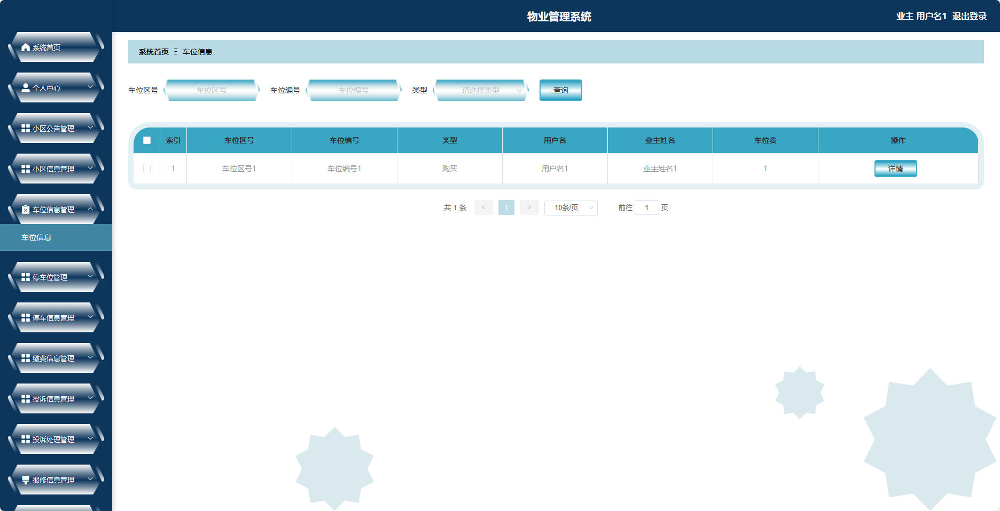
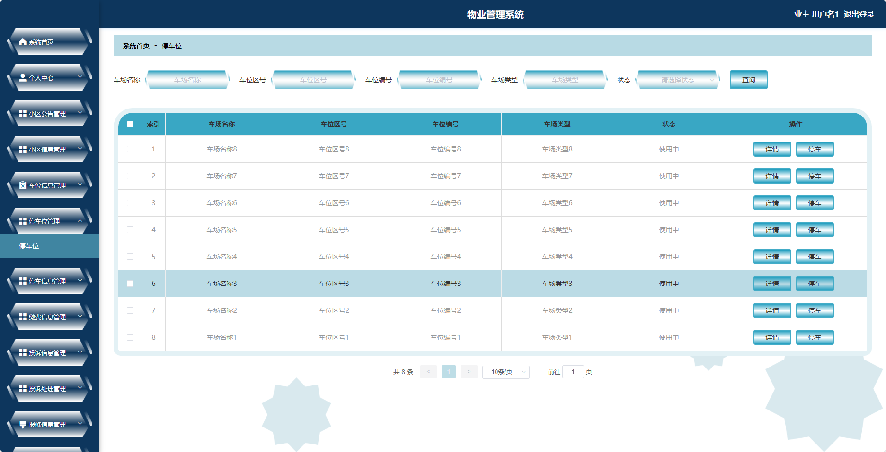
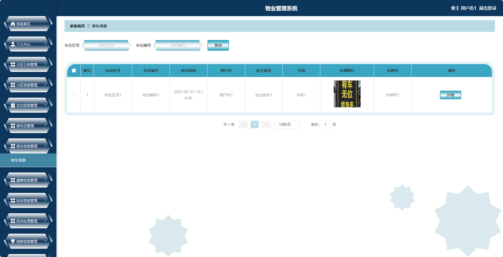
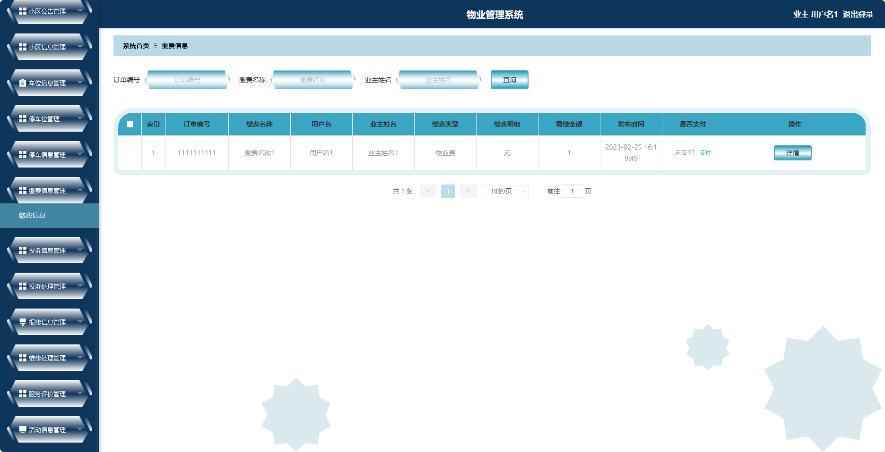
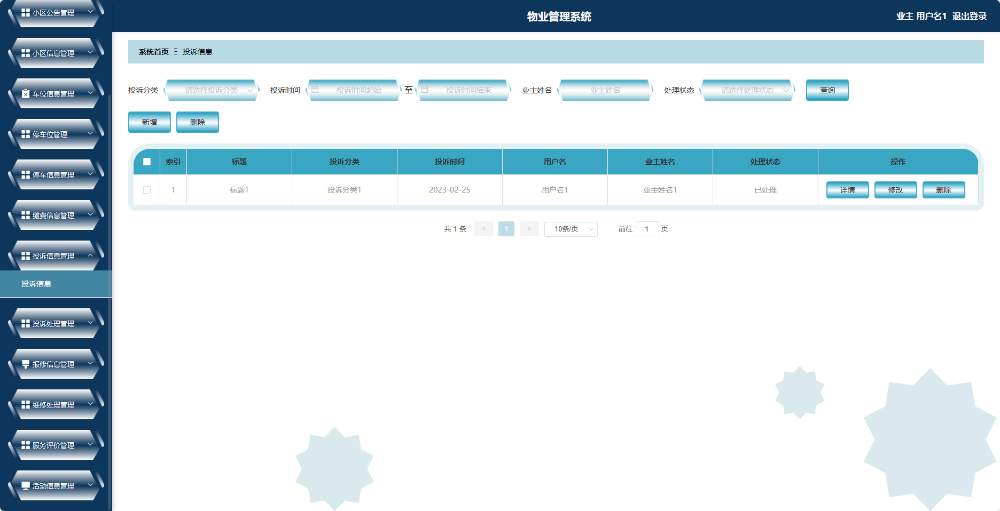
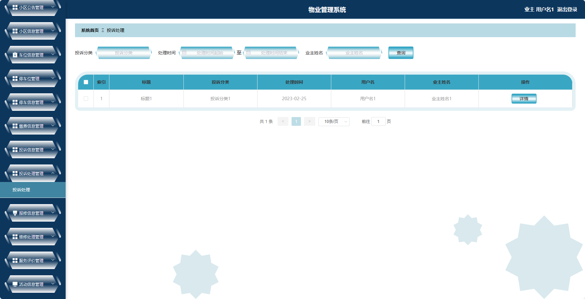
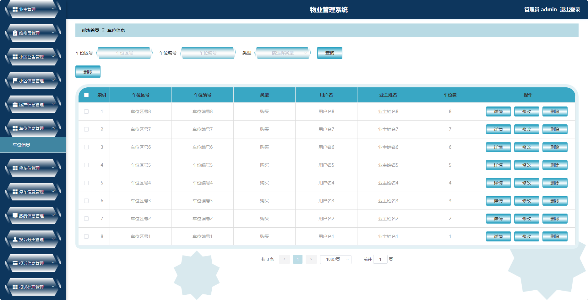
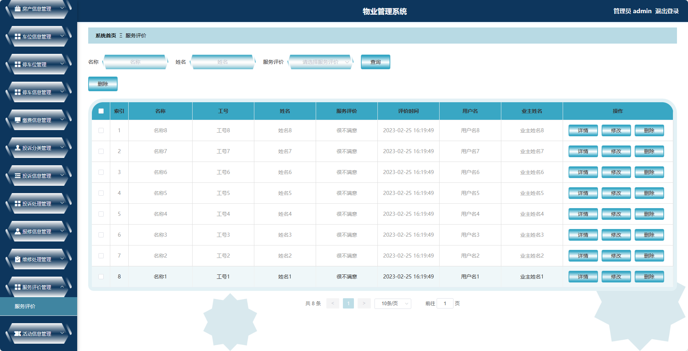

## 基于SpringBoot的物业管理系统(程序+报告)

###  获取sql数据库文件: 从戎源码网 (https://armycodes.com/) QQ: 386869957 QQ群: 377586148
###  所有系统地址: (https://github.com/YuLin-Coder/AllProjectCatalog) 
###  所有项目以及源代码本人均调试运行无问题 可支持远程安装部署调试、定制修改、代码讲解

## 项目介绍
基于SpringBoot的物业管理系统，系统包含两种角色：管理员、用户,系统分为前台和后台两大模块，主要功能如下。

### 【管理员】:
- 个人中心：管理员可以管理个人信息，修改密码等。
- 物业管理：管理员可以管理物业服务相关的信息。
- 业主管理：管理员可以对业主信息进行增删改查等操作。
- 维修员管理：管理员可以管理维修员信息。
- 小区公告管理：管理员可以发布小区相关的公告通知。
- 小区信息管理：管理员可以管理小区的基本信息。
- 房产信息管理：管理员可以管理房产的基本信息。
- 车位信息管理：管理员可以管理车位的基本信息。
- 停车位管理：管理员可以管理停车位的分配情况。
- 停车信息管理：管理员可以管理停车记录。
- 缴费信息管理：管理员可以管理业主的缴费信息。
- 投诉分类管理：管理员可以管理投诉的分类信息。
- 投诉信息管理：管理员可以管理业主的投诉信息。

### 【用户】:
- 个人中心：用户可以管理个人信息，修改密码等。
- 小区公告管理：用户可以查看小区发布的公告通知。
- 小区信息管理：用户可以查看小区的基本信息。
- 车位信息管理：用户可以查看车位的基本信息。
- 停车位管理：用户可以查看停车位的分配情况。
- 停车信息管理：用户可以查看自己的停车记录。
- 缴费信息管理：用户可以查看自己的缴费信息。
- 投诉信息管理：用户可以提交投诉信息。
- 投诉处理管理：用户可以查看和处理自己提交的投诉信息。
- 报修信息管理：用户可以提交报修信息。
- 维修处理管理：用户可以查看和处理自己提交的报修信息。
- 服务评价管理：用户可以对物业服务进行评价。
- 活动信息管理：用户可以查看小区的活动信息。

### 物业管理角色：
- 个人中心：物业管理人员可以管理个人信息，修改密码等。
- 业主管理：物业管理人员可以对业主信息进行增删改查等操作。
- 小区公告管理：物业管理人员可以发布小区相关的公告通知。
- 小区信息管理：物业管理人员可以管理小区的基本信息。
- 房产信息管理：物业管理人员可以管理房产的基本信息。
- 车位信息管理：物业管理人员可以管理车位的基本信息。
- 停车位管理：物业管理人员可以管理停车位的分配情况。
- 停车信息管理：物业管理人员可以管理停车记录。
- 缴费信息管理：物业管理人员可以管理业主的缴费信息。
- 投诉信息管理：物业管理人员可以管理业主的投诉信息。
- 投诉处理管理：物业管理人员可以处理业主提交的投诉信息。
- 报修信息管理：物业管理人员可以管理报修信息。
- 维修处理管理：物业管理人员可以处理报修信息。
- 服务评价管理：物业管理人员可以查看和管理服务评价。

### 维修员角色：
- 个人中心：维修员可以管理个人信息，修改密码等。
- 报修信息管理：维修员可以查看待处理的报修信息。
- 维修处理管理：维修员可以处理报修信息，并更新处理进度。
- 服务评价管理：维修员可以查看和管理服务评价。

## 项目技术
- 编程语言：Java
- 数据库：MySQL
- 项目管理工具：Maven
- 前端技术：HTML、CSS、JavaScript、Jquery、Vue
- 后端技术：Spring、SpringMVC、MyBatis

## 运行环境
- JDK版本：JDK1.8及以上
- 开发工具：IDEA、Ecplise、Myecplise都可以
- 数据库: MySQL5.7及以上
- Maven：maven3.0及以上
- Node：14.14.0及以上

## 运行截图

